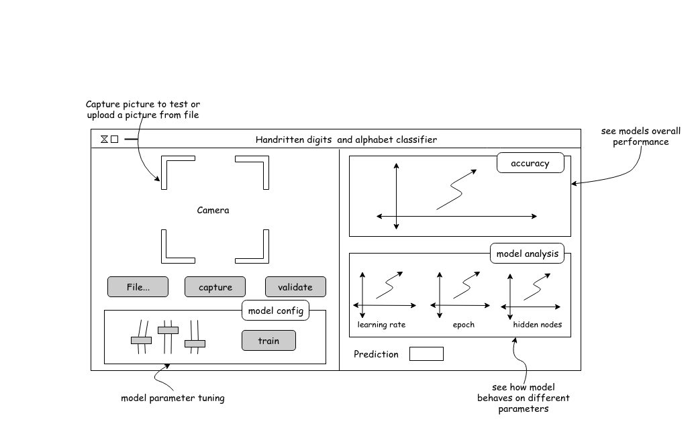

# watch-ml-behave
Elementary handwritten digit and alphabet classifier using supervised learning as part of the class COMP 549 - Human Computer Interaction. The main objective was to put into practice design principles taught in the class.




# The GUI walkthorough
The app is structured into 4 panes. The left side has 3 panes and right side 3 panes.
* The upper-left pane is the object you want to test/analyze.
* mid-left pane control events on what is given to test on upper-left pane.
* low-left pane simple bar graph that gives the accuracy and maps to the label being identified.
* upper-right pane graphs performance comparison between different versions of the model.
* mid-right pane graphs a set of parameters used to tune and improve the overall accuracy of ANN. Also displays individual performance against each setting.
* bottom-right pane has control knobs(sliders) to experiment with different ranges of parameter settings and to see how they affect performance/accuracy of current model being tested.

# what it does
* Lets you experiment and save different versions of ANN you find the settings and accuracy to be appealing.
* Collect different versions of ANN.

# Internal architecture
The appln is built of two layers - The GUI layer and service(backend) layer. The communication is handled using REST interface.
Before you launch the app, you need to train the classifier and serialize its memory to persistant storage.

```python
from settings import *
from neuralnet.train import Learn, Model

l = Learn()
params = l.getparams()

print(params) 
>>> {'epoch': 1, 'input_nodes': 784, 'learning_rate': 0.3, 'output_nodes': 10, 'hidden_nodes': 100}

nn = l.run()
m = Model(nn)
m.save()
```

# running the app.
On one terminal, 
```console
term1$ python run.py


```
On terminal two,
```console
term2$ python tkgui/main.py


```

# development and goals
* to change the way the app is launched. Dockerize the service layer and use AWS as remote machine.
* change from REST to RPC communication mechanism.
* reduce app launch time
* develop alternative UIs like webui, cli
* add support to train the ANN from GUI with subjective training dataset options
* extend the neural network to read and recognize multi-digits, alphabets and alpha-numerics, multimedia
* improve current graphing. Specifically, highlight the active on-the-fly model being tunned and experimented with.
